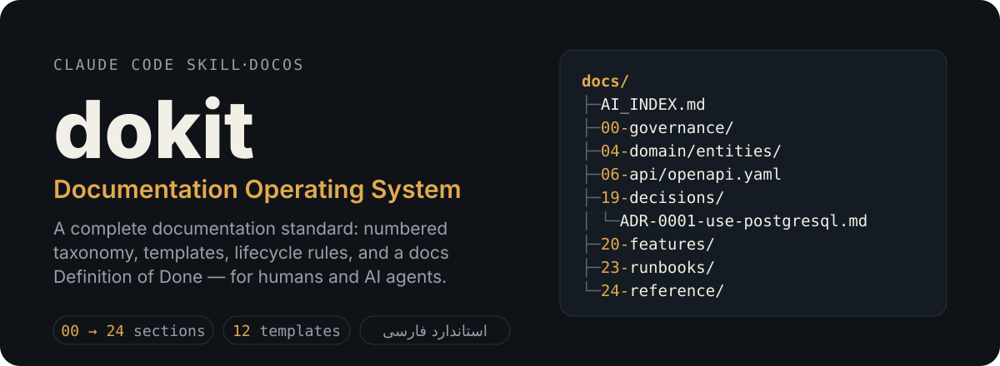
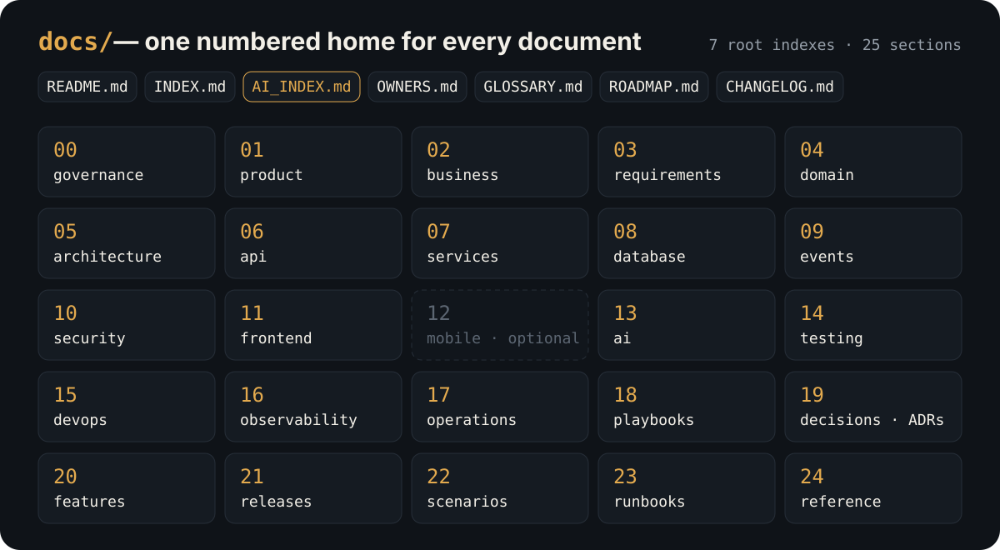
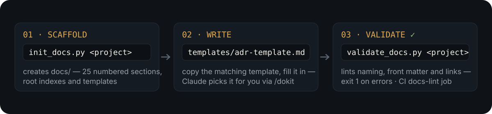

<p align="center">
  
</p>

**dokit** packages **DocOS — the Documentation Operating System** — as a
[Claude Code](https://claude.com/claude-code) skill. It gives every project the
same disciplined documentation layer: a numbered `docs/` taxonomy, a template
for every document type, naming and lifecycle rules, and a documentation
Definition of Done that ties docs to code changes — usable by humans and AI
agents alike.

## One home for every document

<p align="center">
  
</p>

Single source of truth, enforced by structure: the API contract lives in
`06-api/openapi.yaml`, decisions in `19-decisions/` as ADRs, domain shape in
`04-domain/`, operational procedures in `23-runbooks/`. Nothing is duplicated —
everything else links. Every document carries front matter (owner, status,
version, last review) and follows one naming convention.

The full normative standard (Persian) is in
[`references/standard-fa.md`](references/standard-fa.md);
[`references/structure.md`](references/structure.md) is the quick folder map.

## How it works

<p align="center">
  
</p>

1. **Scaffold** — `init_docs.py` creates the full `docs/` tree with root
   indexes and a starter README in every section (`--minimal` for small
   projects, `--with-mobile` to include `12-mobile`).
2. **Write** — copy the matching file from [`templates/`](templates/) and fill
   it in; with the skill installed, Claude picks the right template,
   destination, and front matter for you.
3. **Validate** — `validate_docs.py` lints the tree: required files, naming
   conventions, ADR filename format, front matter statuses, broken links.
   It exits non-zero on errors, so it drops straight into CI as a `docs-lint`
   job.

## Install as a Claude Code skill

```bash
# per project
git clone git@github.com:alifazl3/dokit.git .claude/skills/dokit

# or globally
git clone git@github.com:alifazl3/dokit.git ~/.claude/skills/dokit
```

Then in any session: ask Claude to document something, or invoke `/dokit`.
Claude scaffolds the tree, picks templates, enforces the Definition of Done,
and keeps `CHANGELOG.md` current as part of finishing each change.

After updating the skill (`git pull` in the skill directory), run
`/dokit upgrade` in each project: it re-checks the whole `docs/` tree against
the current version of the standard and fixes documents written under older
versions — safe to run any time, it changes nothing on a conforming tree.

## Use the scripts directly (no Claude needed)

```bash
python scripts/init_docs.py /path/to/project            # full structure
python scripts/init_docs.py /path/to/project --minimal  # small projects
python scripts/validate_docs.py /path/to/project        # lint (exit 1 on errors)
```

## What's inside

```
dokit/
├── SKILL.md                  # the skill: rules Claude applies + workflow
├── references/
│   ├── standard-fa.md        # full DocOS standard (fa)
│   └── structure.md          # folder map quick reference
├── templates/                # ADR, feature, entity, service, api, runbook,
│                             # playbook, scenario, incident, release,
│                             # architecture, changelog entry
├── hooks/
│   └── changelog-stop-hook.sh  # Stop hook: no change ends without its
│                               # docs/changelog/{date}_{title}.md entry
└── scripts/
    ├── init_docs.py          # scaffold docs/ in a project
    └── validate_docs.py      # lint the docs/ tree (CI-friendly)
```

Per-change changelog entries are **on by default**: every finished change also
writes `docs/changelog/{date}_{title}.md` (Summary, Files Changed, Tests Run,
Follow-ups / Risks). Ask Claude to skip them if you don't want that, or leave
the Stop hook unregistered — `SKILL.md` shows the one-block
`.claude/settings.json` registration.

---

With special thanks to [@shakouri10](https://github.com/shakouri10), who came
up with the idea for this documentation system — after a few attempts
together, it grew into this skill.
